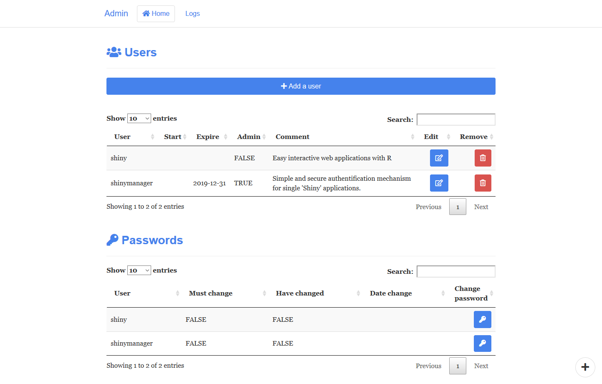
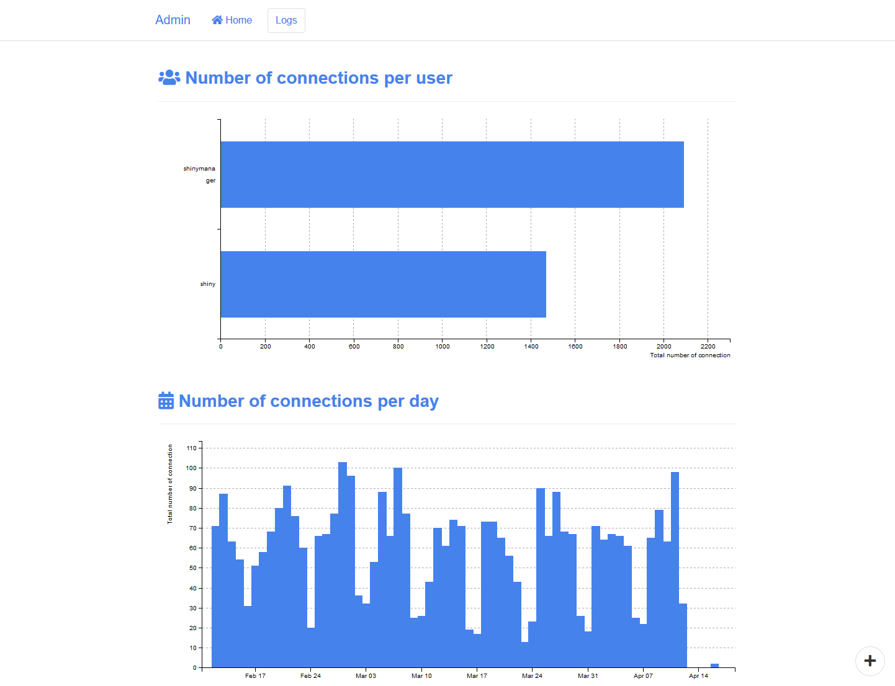
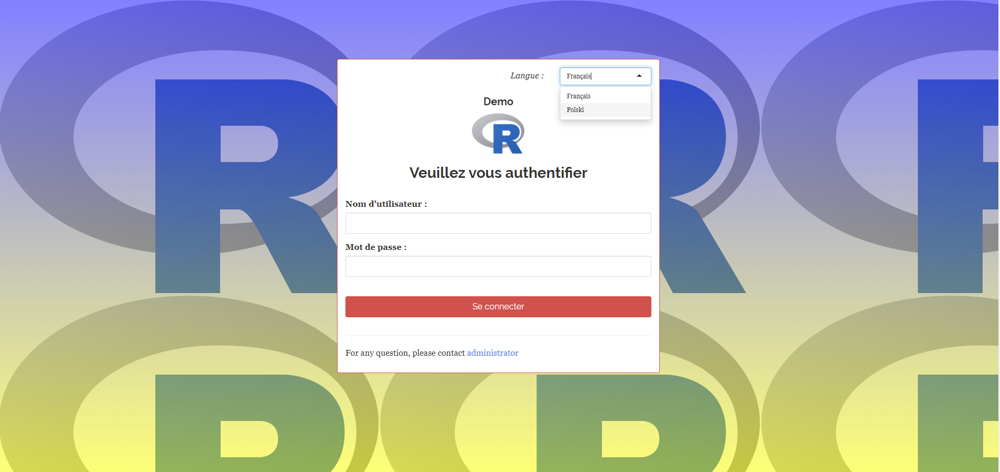

# shinymanager


Suite et fin de notre série sur les packages **shiny** chez **Datastorm** avec notre *best-seller*, à savoir **shinymanager**

En effet, la question de la sécurisation de l’accès à nos applications **shiny** est primoridale : comment contrôler les utilisateurs et gérer les droits, qui peuvent varier en fonction des profils ?

Nous avons donc développé **shinymanager** pour proposer une solution gratuite et simple d’utilisation face à cette problématique.

Le package est sur le **CRAN** depuis le juin 2019, et il a naturellement trouver assez rapidement son public avec maintenant plus de 2000 téléchargements par mois. Public qui a d'ailleurs contribué a son enrichissement, avec maintenant 6 langues disponibles dans le package ! (français, anglais, allemand, espagnol, portuguais et polonais)


### Sécurité

**Shinymanager** utilise des requêtes *http* couplées à des *tokens sha256* temporaires afin de garantir l’accès à l’application. Avec ce système, le code source de l'application est totalement protégé. En complément, la base de données d’authentification *SQLite* est cryptée à l’aide d’[`openssl`](https://github.com/jeroen/openssl) et d’une clé de chiffrement et les mots de passe sont *hashés* avec [`scrypt`](https://github.com/rstudio/rscrypt), ce qui garantie leur confidentialité.

### Installation

Depuis le **CRAN** : 

```r
install.packages("shinymanager")
```

La version de développement étant disponible depuis notre **GitHub** :

``` r
if(!require(devtools)) install.packages("devtools")
devtools::install_github("datastorm-open/shinymanager")
```

### Application de démonstration

Une application de démonstration est disponible 

- directement dans le package : (version github uniquement pour le moment)

``` r
shiny::runApp(system.file("demo_app", package = "shinymanager"))
```

- et en ligne à l’adresse suivante : https://datastorm-demo.shinyapps.io/shinymanager/
    + user: shiny / password: shiny
    + user: shinymanager / password: shinymanager (Admin)


### Fonctionnement

**Shinymanager** propose plusieurs modes de fonctionnement :

- L’utilisation d’une base de données *SQLite* chiffrée. Ce choix préférentiel permet notamment par la suite d’administrer la base des utilisateurs et d’accéder aux logs d’utilisation directement depuis l'application.
- L'utilisation d'une fonction *dédiée* pour définir les règles d'accès, *via* une base de données interne par exemple
- L’utilisation directe d’une table contenant les informations de connexion.


#### Fonctions principales

- **secure_app** : à appeler sur toute la partie *ui* pour la page d'authentification

```r
ui <- fluidPage(
  # ui code
)

# ajouter secure_app à la fin du fichier ui.R
secure_app(ui)
```


- **secure_server** :  à insérer en haut du *server* pour contrôler les accès
    + on peut récupérer ensuite les informations disponibles sur l'utilisateur
    + et quelques *inputs* sont également créés

```r
shinyServer(function(input, output) {
    # secure_server en haut du server
    res_auth <- secure_server(
      check_credentials = check_credentials(credentials)
    )

    # recuperation des infos utilisateurs
    output$auth_output <- renderPrint({
      reactiveValuesToList(res_auth)
    })

    # si besoin, des inputs sont créés
    observe({
      print(input$shinymanager_where)
      print(input$shinymanager_language)
    })
    
    # votre server.R
    
})
```

- **set_labels** : modification des différents labels présents par défaut dans le package

```r
# Dans le global.R :
set_labels(
  language = "en",
  "Please authenticate" = "You have to login",
  "Username:" = "What's your name:",
  "Password:" = "Enter your password:"
)
```

#### Utilisation et administration avec une base de données SQLite

L'utilisation d'une base de données **SQLite** permet de profiter des fonctionnalités d'administration proposées par **shinymanager**, en plus d'avoir un accés sécurisée. Uun nouvel onglet dédié est donc présent dans l'application et permettant l'ajout, la modification, et la suppression des utilisateurs, la gestion des mots de passe (politique, réinitialisation), et proposant une vue des logs d’usage.

Pour commencer, il faut initialiser cette base de données sécurisée : 


```r
?create_db

# Initialisation de la base via un data.frame
credentials <- data.frame(
  user = c("shiny", "shinymanager"),
  password = c("azerty", "12345"),
  # password will automatically be hashed
  admin = c(FALSE, TRUE), # utilisateurs avec droits d'admin ?
  stringsAsFactors = FALSE
)

# il est possible d'utiliser keyring pour sécuriser
# encore plus la clé de chiffrement
library(keyring)
key_set("R-shinymanager-key", "obiwankenobi")

# Initialisation de la base de données
create_db(
  credentials_data = credentials,
  sqlite_path = "path/to/database.sqlite", # elle sera crée
  passphrase = key_get("R-shinymanager-key", "obiwankenobi")
  # passphrase = "passphrase_wihtout_keyring" # mais on peut se passer de keyring...! 
)
```


Et c'est quasiment tout ! Il ne reste plus qu'à brancher l'application sur cette base : 

```r
# enable_admin : autoriser l'onglet admin
ui <- secure_app(ui, enable_admin = TRUE)


server <- function(input, output, session) {
  
  # branchement à la base sqlite
  res_auth <- secure_server(
    check_credentials = check_credentials(
        "path/to/database.sqlite",
        passphrase = key_get("R-shinymanager-key", "obiwankenobi")
        # passphrase = "passphrase_wihtout_keyring"
    )
  )

  # votre server.R
  ...
}
```

**interface d'administration**

*Changement de mot de passe :*


*Gestion des utilisateurs :*



*Historique de connexions :*



#### Fonction personnalisée d'authentification

Il est également possible d'utiliser votre propre fonction d'authentification. Il faut pour cela la passer à l'argument ``check_credentials`` en respectant certaines conventions : 

- La fonction finale doit contenir deux arguments ``user`` et ``password``
- Et retourner une liste avec au-moins : 
    + ``result`` (``TRUE`` si l'utilisateur est autorisé à accéder à l'application,  ``FALSE`` sinon) 
    + ``user_info`` (une liste contenant toutes les infos que vous souhaitez récupérer sur l'utilisateur dans l'application)

*exemple avec une base RPostgreSQL :*

````R
require(RPostgreSQL)
library(shiny)
library(shinymanager)
library(DBI)
library(glue)

dbname = "*****"
host = "localhost"
port = *****
user = "*****"
password = "******"

# initialisation, pour l'exemple
con <- dbConnect(dbDriver("PostgreSQL"), dbname = dbname , host = host, port = port ,
                 user = user, password = password )


DBI::dbWriteTable(con, "my_table", data.frame(
  user = c("test"),
  password = c("123"),
  stringsAsFactors = FALSE
))

# ici une fonction qui prend en compte tous les paramètres de connexion
# mais on peut passer ce que l'on veut (un .yml par exemple)
my_custom_check_creds <- function(dbname, host, port, db_user, db_password) {
  
  # retourne une fonction de user et password
  function(user, password) {
    
    con <- dbConnect(dbDriver("PostgreSQL"), dbname = dbname, 
                     host = host, port = port,
                     user = db_user, password = db_password)
    
    on.exit(dbDisconnect(con))
    
    req <- glue_sql("SELECT * FROM my_table WHERE \"user\" = ({user}) AND \"password\" = ({password})", 
             user = user, password = password, .con = con
    )
    
    req <- dbSendQuery(con, req)
    res <- dbFetch(req)
    # qui retourne une liste
    if (nrow(res) > 0) {
      list(result = TRUE, user_info = list(user = user, something = 123))
    } else {
      list(result = FALSE)
    }
  }
}

# ui
ui <- secure_app(ui)

# server
server <- function(input, output, session) {
  res_auth <- secure_server(
    check_credentials = my_custom_check_creds(
      dbname = "******",
      host = "*****",
      port = ****,
      db_user = "*****",
      db_password = "*******"
    )
  )  
  auth_output <- reactive({
    reactiveValuesToList(res_auth)
  })
  
  # access info
  observe({
    print(auth_output())
  })
}

shinyApp(ui, server)
````

#### Customisation de l'interface

En complément, **shinymanager** propose pas mal d'options pour customiser l'interface de connexion et la console d'administration : 

- **status** : *bootstrap status* ("default", "primary", "success", "warning", "danger")
- **tags_top** : 	élement(s) html (*div*, *img*,...) affiché(s) en haut du module
- **tags_bottom** : 	élement(s) html (*div*, *img*,...) affiché(s) en bas du module
- **background** : 	*css* pour le *background*
- **choose_language** : permettre ou non la sélection de plusieurs langues

````R
ui <- secure_app(ui, 
                 status = "danger",
                 # ajout d'une image en haut ?
                 tags_top = 
                   tags$div(
                     tags$h4("Demo", style = "align:center"),
                     tags$img(
                       src = "https://www.r-project.org/logo/Rlogo.png", width = 100
                       # le chemin pourrait être local (www/img/image.jpg -> "img/image.jpg")
                     )
                   ),
                 # information en bas ?
                 tags_bottom = tags$div(
                   tags$p(
                     "For any question, please  contact ",
                     tags$a(
                       href = "mailto:someone@example.com?Subject=Shiny%20aManager",
                       target="_top", "administrator"
                     )
                   )
                 ),
                 # ui background ?
                 # https://developer.mozilla.org/fr/docs/Web/CSS/background
                 background  = "linear-gradient(rgba(0, 0, 255, 0.5),
                       rgba(255, 255, 0, 0.5)),
                       url('https://www.r-project.org/logo/Rlogo.png');", 
                 # langue
                 choose_language = c("fr", "pl"), 
                 language = "fr"
)
````




### Des soucis lors de l'intégration de shinymanager ?

Si votre application marchait bien avant de brancher ``shinymanager``, mais que vous rencontrez des soucis après, cela est sûrement dû à des contrôles *manquants* dans votre *server.R* sur tous vos ``reactive/observer``. En effet, il y a un certain *lag* entre la partie *ui* et *server* tant que l'authentification n'a pas été effective, ce qui fait que certains éléments du *ui* (input) peuvent ne pas être encore définis, et donc ``NULL``. 

**Nous vous recommendons d'utiliser l'instruction ``req`` pour valider la présence des inputs**

### Next step

**shinymanager** est déjà un projet très matûre. Actuellement, bien qu'il soit possible de se connecter avec le mécanisme / la fonction de son choix, la partie administration n'est disponible et fonctionnelle qu'en passant par une base *sqlite*. Nous essaierons de relâcher cette contrainte *sqlite only* dans le futur.

https://datastorm-open.github.io/shinymanager/
