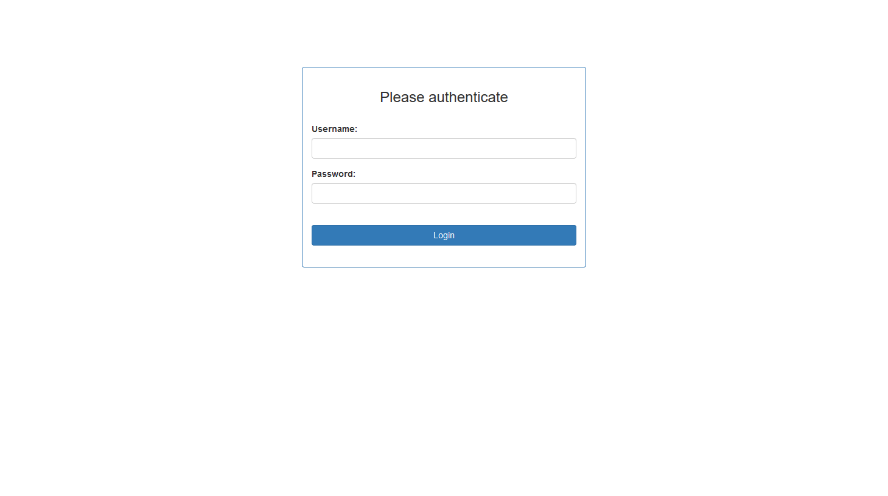
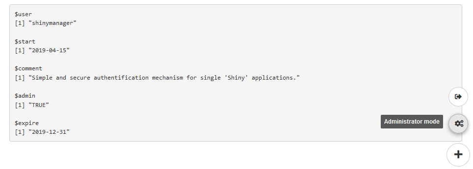
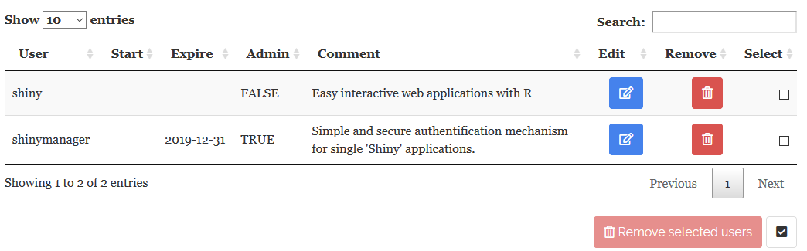
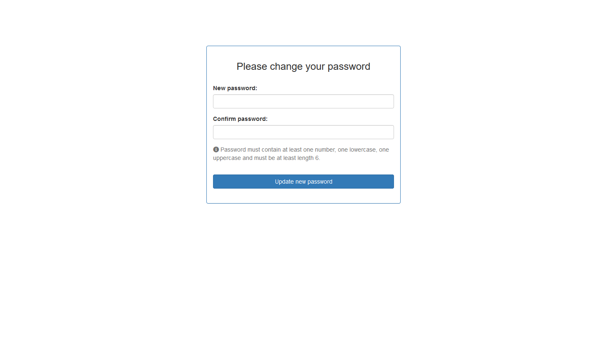
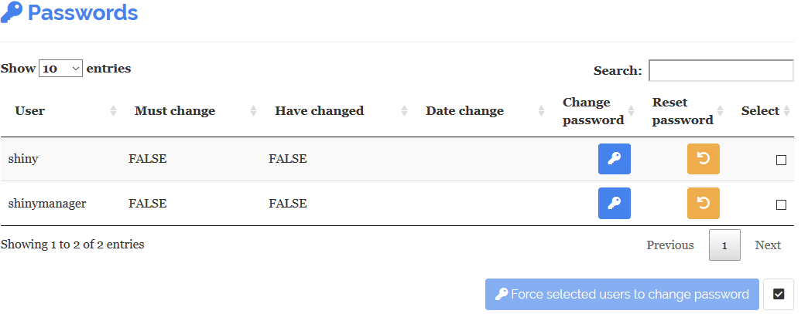

```{r, include = FALSE}
knitr::opts_chunk$set(
  collapse = TRUE,
  comment = "#>"
)
```


## Introduction

Using SQL database protected (``create_db()``), an admin mode is available to manage access to the application, features included are

 * manage users account : add, modify and delete users
 * ask the user to change his password
 * see logs about application usage


```r
# Credentials data
credentials <- data.frame(
  user = c("shiny", "shinymanager"),
  password = c("azerty", "12345"),
  # password will automatically be hashed
  admin = c(FALSE, TRUE),
  stringsAsFactors = FALSE
)

# you can use keyring package to set database key
library(keyring)
key_set("R-shinymanager-key", "obiwankenobi")

# Init the database
create_db(
  credentials_data = credentials,
  sqlite_path = "path/to/database.sqlite", # will be created
  passphrase = key_get("R-shinymanager-key", "obiwankenobi")
  # passphrase = "passphrase_wihtout_keyring"
)

# Wrap your UI with secure_app, enabled admin mode or not
ui <- secure_app(ui, enable_admin = TRUE)


server <- function(input, output, session) {
  
  # check_credentials directly on sqlite db
  res_auth <- secure_server(
    check_credentials = check_credentials(
        "path/to/database.sqlite",
        passphrase = key_get("R-shinymanager-key", "obiwankenobi")
        # passphrase = "passphrase_wihtout_keyring"
    )
  )
  
  output$auth_output <- renderPrint({
    reactiveValuesToList(res_auth)
  })
  
  # your classic server logic
  ...
}
```

Starting page of the application will be :

{width=100%}


Once logged, the application will be launched and a button added to navigate between the app and the admin panel (if user is authorized to access it), and to logout from the application :

{width=100%}


## Admin mode

{width=100%}


### Manage users

The first table lists all current users :

{width=100%}

A user is defined (at least) by the following information : 

- **User** : username
- **Start** & **Expire** : optional dates of validity. If missing, access is not restricted to a specific period
- **Admin** : user as administrator ? (``TRUE`` / ``FALSE``)

####	Add user

{width=100%}

Using **Add user** button. So you can edit user information in the modal box :

{width=50%} 

Notes : 

-	**User** : Canno't create existing user
-	**Start & Expire** : Keep empty for no restriction
- **Password** : By defaut, a temporary password is generated. But you can put your own password and disable asking user to change it on first connexion. 

{width=100%}

Finally, the creation is effective clicking on validation button.

### Edit current user

It's possible to edit user information clicking on the blue ``button`` on the table.

####	Remove a user

You can remove one user using red ``button`` on table.


#### Password management

The second table allows password management : 

{width=100%}

- **Change password button :** Ask user to change password on next connexion
- **Reset password button :** If needed, a nex temporary password is generated. You have to give it to the user.

Moreover, by defaut, the module uses some security rules : 

- at least 6 character
- one number, one uppercase, one lowercase

Additive information : 

- **Must change** : The user have to change his password
- **Have changed** : The user already changed his password
- **Date change** : Password updated date

 
### Logs

You can visualize and download connexion logs on the second tab.


{width=100%}


