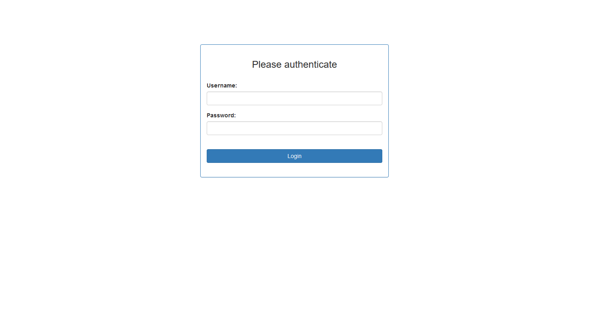
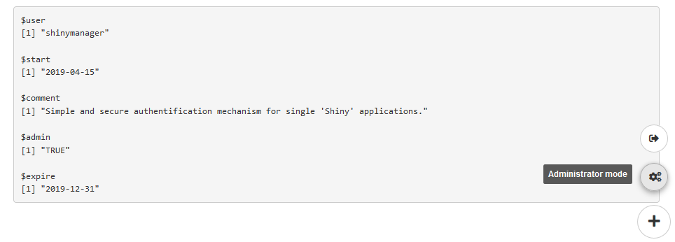
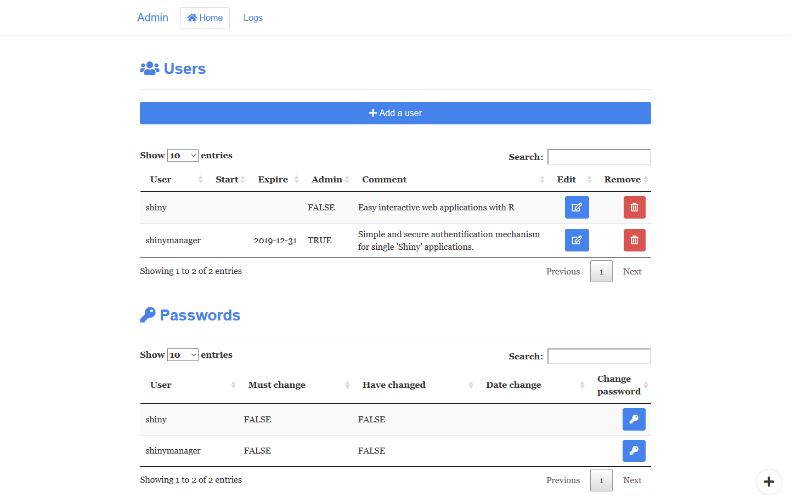
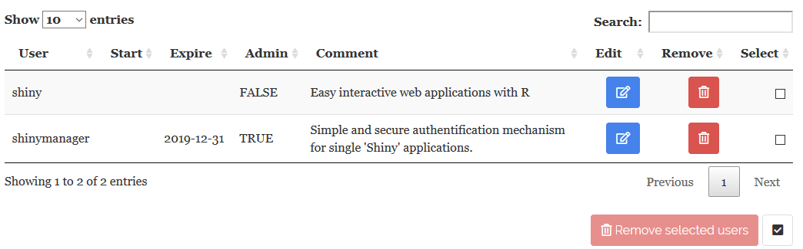
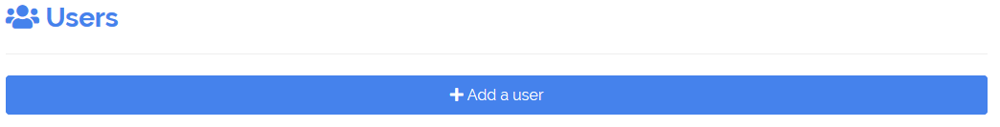
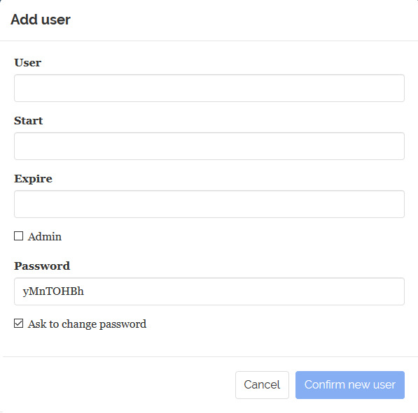
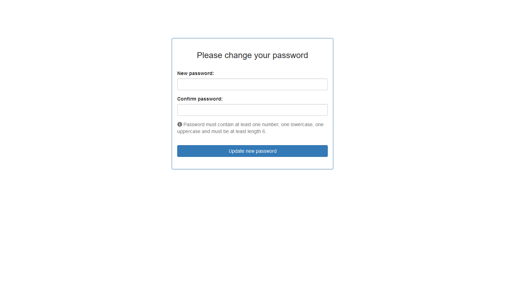
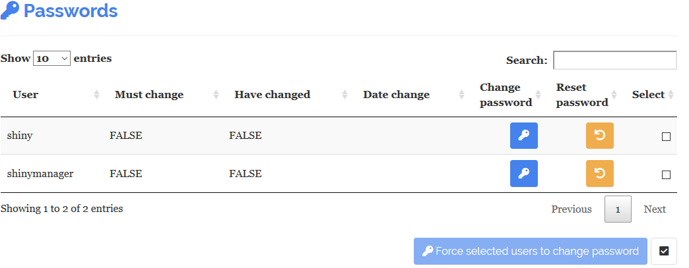
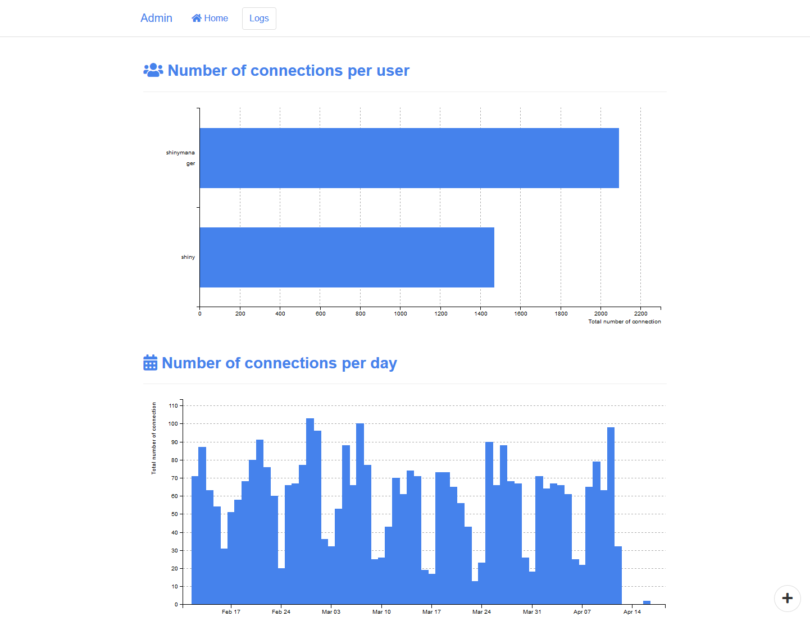

```{r, include = FALSE}
knitr::opts_chunk$set(
  collapse = TRUE,
  comment = "#>"
)
```


## Introduction

Using SQL database protected (``create_db()``), an admin mode is available to manage access to the application, features included are

 * manage users account : add, modify and delete users
 * ask the user to change his password
 * see logs about application usage


```r
# Credentials data
credentials <- data.frame(
  user = c("shiny", "shinymanager"),
  password = c("azerty", "12345"),
  # password will automatically be hashed
  admin = c(FALSE, TRUE),
  stringsAsFactors = FALSE
)

# you can use keyring package to set database key
library(keyring)
key_set("R-shinymanager-key", "obiwankenobi")

# Init the database
create_db(
  credentials_data = credentials,
  sqlite_path = "path/to/database.sqlite", # will be created
  passphrase = key_get("R-shinymanager-key", "obiwankenobi")
  # passphrase = "passphrase_wihtout_keyring"
)

# Wrap your UI with secure_app, enabled admin mode or not
ui <- secure_app(ui, enable_admin = TRUE)


server <- function(input, output, session) {
  
  # check_credentials directly on sqlite db
  res_auth <- secure_server(
    check_credentials = check_credentials(
        "path/to/database.sqlite",
        passphrase = key_get("R-shinymanager-key", "obiwankenobi")
        # passphrase = "passphrase_wihtout_keyring"
    )
  )
  
  output$auth_output <- renderPrint({
    reactiveValuesToList(res_auth)
  })
  
  # your classic server logic
  ...
}
```

Starting page of the application will be :

{width=100%}


Once logged, the application will be launched and a button added to navigate between the app and the admin panel (if user is authorized to access it), and to logout from the application :

{width=100%}


## Admin mode

{width=100%}


### Manage users

The first table lists all current users :

{width=100%}

A user is defined (at least) by the following information : 

- **User** : username
- **Start** & **Expire** : optional dates of validity. If missing, access is not restricted to a specific period
- **Admin** : user as administrator ? (``TRUE`` / ``FALSE``)

####	Add user

{width=100%}

Using **Add user** button. So you can edit user information in the modal box :

{width=50%} 

Notes : 

-	**User** : Canno't create existing user
-	**Start & Expire** : Keep empty for no restriction
- **Password** : By defaut, a temporary password is generated. But you can put your own password and disable asking user to change it on first connexion. 

{width=100%}

Finally, the creation is effective clicking on validation button.

### Edit current user

It's possible to edit user information clicking on the blue ``button`` on the table.

####	Remove a user

You can remove one user using red ``button`` on table.


#### Password management

The second table allows password management : 

{width=100%}

- **Change password button :** Ask user to change password on next connexion
- **Reset password button :** If needed, a nex temporary password is generated. You have to give it to the user.

Moreover, by defaut, the module uses some security rules : 

- at least 6 character
- one number, one uppercase, one lowercase

Additive information : 

- **Must change** : The user have to change his password
- **Have changed** : The user already changed his password
- **Date change** : Password updated date


#### Self-service password reset by email

Enabling ``options("shinymanager.reset_password" = TRUE)`` adds a *"Forgot password?"* link on the authentication page, so a user can reset the password without the admin.

The user enters a username and its associated email. If they match a record, a temporary password is generated, sent by email, and the user must change it on next login (same security rules as above). A generic confirmation message is displayed (before sending the email), whether or not the email matches, to avoid account enumeration. Known limits : an account that can't reset its password gets a dedicated message and a failed sending shows an error popup, which both reveal that the account exists. The reset button is enabled again after the same minimal delay (a few seconds) whatever the outcome, unless the sending takes longer. No reset is done for an expired account or an account not authorized for the application.

**Note** : the temporary password replaces the current one as soon as the email is sent, before the user proves access to the mailbox. Anyone who knows a username (and its email with ``TRUE``) can thus invalidate the password of this account, and use up its resets when ``shinymanager.reset_password_max`` is set. We recommend the ``TRUE`` mode rather than ``"username"``, and to set ``shinymanager.reset_password_max`` knowing this risk.

With ``options("shinymanager.reset_password" = "username")``, the form only asks for a username and the temporary password is sent to the email stored for that user (if any).

With ``options("shinymanager.reset_password_validity" = 20)``, the emailed temporary password is only valid for 20 minutes (default : no expiration). A new request replaces the previous one. Passwords generated by the admin are not concerned, and an admin reset cancels a pending emailed password. The expiration is stored in a ``temp_pwd_expire`` column of the *pwd_mngt* table, created automatically. The ``send_mail`` function does not receive the validity : we recommend to mention it in the email, reading it with ``getOption("shinymanager.reset_password_validity")`` (see example below).

With ``options("shinymanager.reset_password_max" = 3)``, a user can only request 3 resets in a row (default : no limit). The counter is reset on the next successful login with a non temporary password, or by an admin reset (stored in a ``n_user_reset`` column of the *pwd_mngt* table, created automatically). It is shown in the *Passwords* table of the admin panel.

With ``options("shinymanager.reset_password_unlock" = FALSE)``, an account locked by ``shinymanager.pwd_failure_limit`` can only be unlocked by the admin (*Reset password* button) : no email is sent. By default the reset unlocks the account. When a failure limit is set, a *Locked* column is shown in the *Passwords* table.

Requirements :

- an ``email`` column in the *credentials* (or another column name set with ``options("shinymanager.email_column" = "my_col")``),
- a SQLite / SQL backend,
- a ``send_mail`` function passed to ``secure_server``.

No email package is mandatory : you provide your own ``send_mail`` function (three arguments : ``user``, ``email`` and ``temp_password``) using any backend, or use the optional helper ``send_smtp_mail()`` built on the suggested ``emayili`` package.

```r
server <- function(input, output, session) {

  res_auth <- secure_server(
    check_credentials = check_credentials("path/to/database.sqlite", passphrase = "supersecret"),
    send_mail = function(user, email, temp_password) {
      send_smtp_mail(
        to = email, from = "no-reply@example.com",
        subject = "Password reset",
        body = paste0(
          "Hello ", user, ", your temporary password is : ", temp_password,
          # if options("shinymanager.reset_password_validity") is set
          "\nIt is valid for ", getOption("shinymanager.reset_password_validity"), " minutes."
        ),
        host = "smtp.example.com", port = 587,
        username = "no-reply@example.com", password = "smtp_secret"
      )
    }
  )

  # your classic server logic

}
```


### Logs

You can visualize and download connexion logs on the second tab.

Below the connection graphs :

- **Users overview** : for each user, the last connection and application (all periods and applications), the number of connections, wrong passwords and password resets on the selected period, and whether the account is locked (when ``shinymanager.pwd_failure_limit`` is set).
- **Security events** : counters (locked accounts, wrong passwords, unknown users, password resets, failed resets, email errors) and the number of failed events per day. Unknown usernames are only counted, never displayed, as users sometimes type their password in the username field (they are still in the downloaded logs).


{width=100%}


